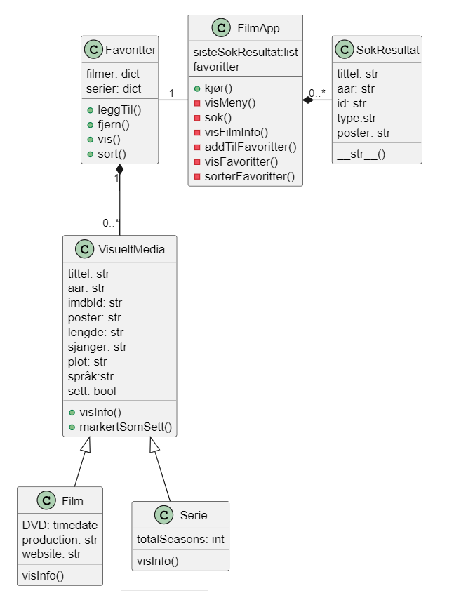
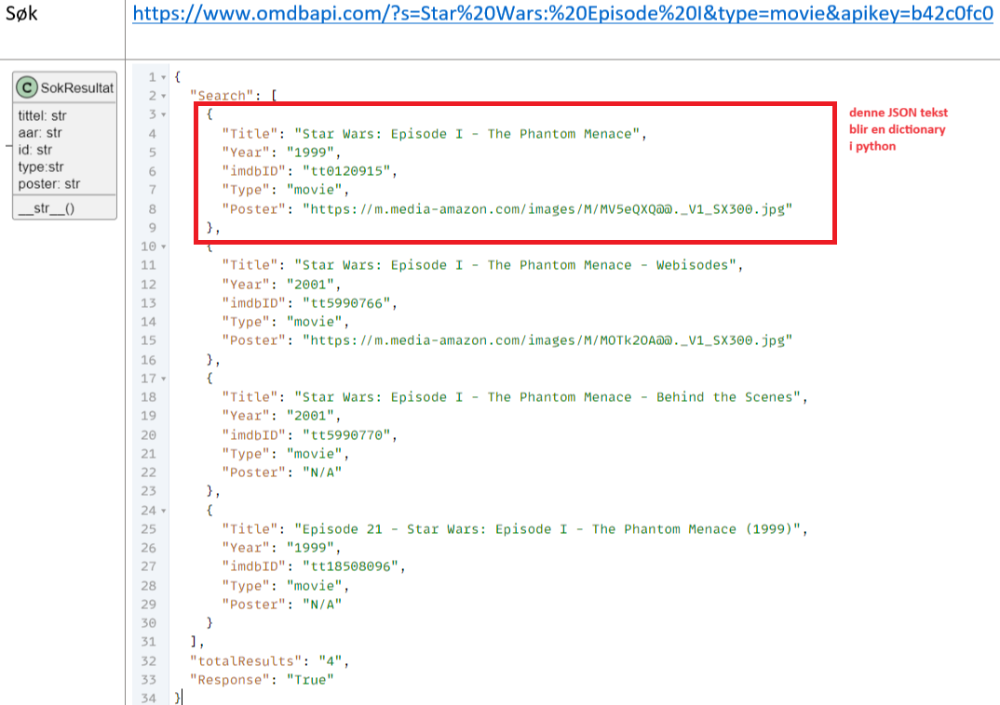
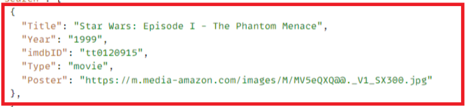
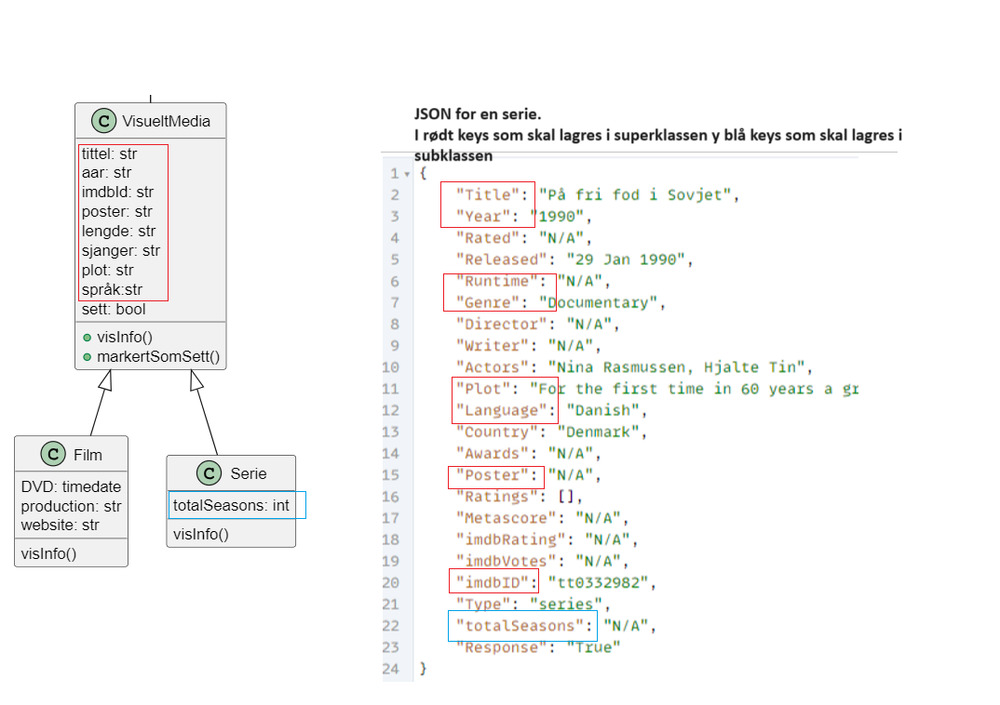
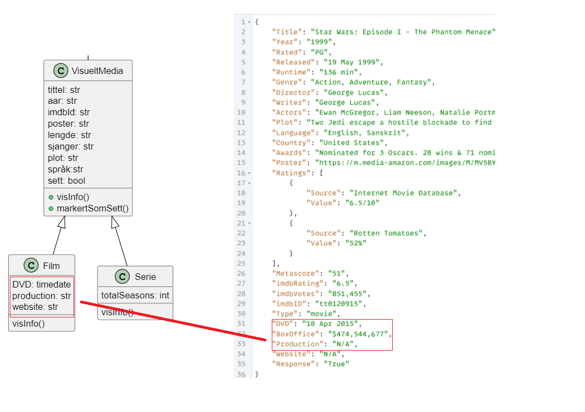

### Hvordan lage en datamodell for Oppgaven som bruker OMDb API-en

De første timene skulle du utforske mulighetene med  [OMDb Film API](https://www.omdbapi.com/), og se hvilken data du kunne hente fra API. Ideen er at ved å se på oppgave beskrivelse og JSON data som sendes ut fra API-en kan man identifisere hvilke objekter man trenger i FilmApp.

Under finner du en forslag til modell for Oppgaven. (Hvis du har laget din egen modell, kan det være du har  litt forskjellige medlemvariabler og metoder for klassene)




Her ser du objekter som er identifisert:

1. Fra oppgave beskrivelse
- Klassen `FilmApp`: for selve appen
- Klassen `Favoritter`: for å holde liste med filmer og serier i bucket list

2. Fra JSON:
- Klassen `"SokResultat"`: for å lagre hvert treff fra en søk
- Klassen `"VisueltMedia"`: for å lagre felles data fra JSON om en film eller en serie (superklasse)
- Klassen `"Film"`: for å lagre spesifikk data for en film (subklasse av VisueltMedie)
- Klassen `"Serie"`: for å lagre spesifikk data for en serie (subklasse av VisueltMedia)


 Ved opprettelse av objekter for disse klasser vil JSON-data man får når man sender en førespørsel til OMDb API brukes i konstruktør

### Fra JSON til Klasser

Her skal du lage klasser for objektene som kommer fra JSON (SokResultat, VisueltMedia, Film og Serie). Du får hjelp til å lage SokResultat-klassen, og så må du lage resten selv. Du får også kode for en enkelt test per klasse som henter data fra json og tester opprettelse av klassen, som du kan kopiere og teste. 

<div style="background-color:lightblue; border:2px solid black; padding:10px; color:black">
<p>
<h4><b>Oppgave</b></h4>
<p>
Det er god praksis å lagre klassene til modellen din i en egen fil, enten samlet eller hver for seg. For enkelheten skyld jeg forelsår at du lager en samelt fil der du oppretter alle klasser du bruker.
Opprett en ny fil <b>Klasser.py</b> i samme Folder der du har python kode for selve appen <b>FilmApp.py</b>
<p>
Siden testene vil bruke JSON-filer trenger du å importerer json-bibliotek i python:
<p>
    <code><b>import json</b></code>
</div>


#### __Klasse "SokResultat"__
I bildet under ser du JSON-data som blir sendt ut av API etter et bestemt søk som ga 4 treff.  __JSON__ er en tekstlig format som er brukt for å utveksle og lagre data, som vi jobbet med i Periode 3. Hvis du husker fra tidligere i IT2, 
hver gang du finner tegn `{` i JSON betyr det at det som kommer etterpå inntil tegn `}` vil bli en dictionary når JSON-data leser opp med python. I tillegg hver gang du finner tegn `[` betyr det at det som kommer etterpå inntill tegn `]` vil bli elementer i en liste i python.

Se på JSON-data i bildet og svar på oppgave under. Klikk på _Sjekk svar her_ for å se på forslag til svar.



<div style="background-color:lightblue; border:2px solid black; padding:10px; color:black">
<p>
<h4><b>Oppgave</b></h4>
<p>
Se på JSON under og finn ut hvor mange dictionary og lister vil bli ut fra denne JSON.
<details>
<summary>
  <b>Sjekk svar her</b>
</summary>
 Det vil bli en dictionary med 3 keys (Search, totalResulst og Response), med hvert sin verdi.
 <p>
 Videre vil verdi for Search-key blir en liste med 4 elementer, og hvert element i liste vil bli igjen en dictionary med nøkkler og verdier (rød-firkant på bildet). Disse dictionary'er identifiserer hvert en treff fra søket.
</details>
</div> 

#### Opprette en objekt med JSON-data

<p>
Bildet over  viser Json-data som representerer informasjon for én treff fra søket. Denne informasjon blir lastet opp i en dictionary  (med 5 nøkkel i dette tilfelle) når JSON-data blir lest opp via python. Vi bruker denne dictionary til å initialisere meldemvariabler til en ny opprettet objekt av type SokResultat. Se kode under:


```python
import json 

#Kode for SokResultat
class SokResultat:
    """ Tar inn en dictionary with the data for this result
        The dictionary tilsvarer json sendt from the API"""
    def __init__(self, data:dict[str, str]):
        self.tittel = data.get("Title")  #Merk storebokstav for nøkkel
        self.aar = data.get("Year")
        self.id = data.get("imdbID")
        self.poster = data.get("Poster")
        self.type = data.get("Type")


    def __str__(self):
            """ Bestemmer hvordan SokResult vil bli skrevet ut når man bruker print """
            return f"Title: {self.tittel}, Year:{self.aar} ..."  #replace ... med resten av informasjon
```

Merk at vi har brukt __data.get("Title")__ i sted t for __data["Title"]__ for å hente verdiene fra dictionary. Dette er for å gjøre kode mer robust. Hvis nøkkel ikke finnes, returneres None, istedet for å kræsje.

<div style="background-color:lightblue; border:2px solid black; padding:10px; color:black">
<p>
<h4><b>Oppgave</b></h4>
<ol>
<li> Kopier koden ovenfor i <b>Klasser.py</b>, Sjekk at den kompilere og forsikre deg at du forstå den. <p>
<li> Metodet "<b> __str__() </b>" blir brukt av python når man skriver __print(sokResultat)__. Endre kode slik at det inkludere også type og id i det som skrives ut.<p>
<li>Når du er ferdig kopier koden for å teste klassen på slutten av <b>Klasser.py</b> (koden finner du under). Testen <b>test_SokResultat()</b> laster opp autentisk JSON-data og tester at klassen blir opprettet riktig.
<li> Oppdatert testen slik at den skriver ut SokResultat-objekt vha. print
</ol>

<div style="background-color:lightblue; border:2px solid black; padding:10px; color:black>
##### Oppgave

Kopier kode over i `Klasser.py` og skriv ferdig kode i __init__ og __str__ slik at alt data fra JSON lagres i objekten.
Når du er ferdig, kan du legge til denne koden under på slutten av filen. Den kjører en enkel test som oppretter en slik objekt og sjekker at alt er riktig.
</div>


```python
if __name__ == "__main__":
     #Kode for å teste klassen SokResultat
    def test_SokResultat():
        
        with open('SearchResult.json', encoding="UTF-8") as fil:
            data = json.load(fil)

        result = SokResultat(data["Search"][0])
        assert result.tittel == "Star Wars: Episode I - The Phantom Menace"
        assert result.type == "movie"
        assert result.aar == "1999"
        assert result.id == "tt0120915"
        assert result.poster == "https://m.media-amazon.com/images/M/M.jpg"
        print(f"test SokResultat ok")


    test_SokResultat()
```

    test SokResultat ok


#### Klassene VisueltMedia, Serie og Film
Når er det ditt turn til å lage klasser Visuelt Media, Serie og Film. Jeg foreslår at du skriver kode for alle tre resterende klassene også i `Klasser.py`, så etterpå trenger du bare å importere denne filen i `FilmApp.py`

I bildet ser du foreslått UML-modell med medlemsvariabler og metoder for klassen VisueltMedie, Serie og Film og JSON-data som kommer fra API når man henter en Serie. Forslag til medlemvariabler for klassen __VisueltMedia__ og hvilke nøkler fra JSON-dictionary som skal brukes er merket i rød, mens meldemesvaribler for __Serie__ er merket i blå.




<div style="background-color:lightblue; border:2px solid black; padding:10px; color:black">
<p>
<h4><b>Oppgave</b></h4> 
<p>
<ol>
<li>Skriv kode for klassen `VisueltMedia`. Du må skrive kode for "<b> __init__()</b>" som tar inn en dictionary som parameter, slik du gjorde med  "<b>
SokResultat </b>"<p>
Lag tomme metoder ved hjelp av __pass__
<li> Skriv kode for klassen `Serie`. Den arver fra VisueltMedia. Du må kaller på konstruktør til sin superklassen først før den legge til meldemsvariabel som er spesifikke for __Serie__ (se Tips under om du trenger hjelp).<p>
<li>Kopier koden for "<> test_Serie()</b>" (se under) til <b>Klasser.py</b> på riktig sted, og kjør koden for å teste de nye klassene dine. Den laster opp autentisk JSON-data for en serie og tester at klassen blir opprettet riktig.<p>
</ol>
<p>
<details>
<summary>
   TIPS: Sjekk her for tips på hvordan du skriver kode for subklasser.
   <p>
</summary>
    Når du arver fra en andre klasse, må du skrive den andre klasse i parentes. I tillegg må du kalle superklassen sin konstruktor før du legger til spesifikke medlemvariabler for klassen.
   <p>
   <pre><code>
    class Serie(VisueltMedia):
      def __init__(self, data:dict[str, str]):
          super().__init(self, data)
          self.totalSessonger = data.get("TotalSeasons")
</code></pre>
</details>
</div>


<details>
<summary>
   Forslag til kode for Serie
   <p>
</summary>
   <p>
   <pre>
<code>
    class Serie(VisueltMedia):
      def __init__(self, data:dict[str, str]):
          super().__init(self, data)
          self.totalSessonger = data.get("TotalSeasons")
</code>
</pre>
</details>
</div>


```python
#Kode for å teste klassen Serie
def test_Serie():
      
     with open('Serie.json', encoding="UTF-8") as fil:
          data = json.load(fil)

     serie = Serie(data)
     assert serie.tittel == "Star Trek"
     assert serie.aar == "1987–1994", f"{serie.aar}"
     assert serie.id == "tt0092455" 
     assert serie.poster == "https://m.media-amazon.com/images/M/M.jpg"
     assert serie.lengde == "44 min"
     assert serie.sjanger == "Action, Adventure, Drama"
     assert serie.totalSessonger == 7

     print(f"test Serie ok")

test_Serie()
```


I bildet under du UML-modell med medlemsvariabler og metoder for klassen og JSON-data som kommer fra API for klassen Film
Klassen `Film` arver også fra VisueltMedia, og har bare tre meldemvariabler som er spesifikke for film. 



<div style="background-color:lightblue; border:2px solid black; padding:10px; color:black">
<p><h4><b>Oppgave</b></h4> 
<ol>
<li>Skriv kode for klassen `Film`. Den arver fra VisueltMedia. I bildet ovenfor ser du forslag for medlemvariabler som er spesifikke for __Film__, og hvilke nøkler fra JSON-dictionary som skal brukes (merket i rød)
<li>Kopier koden for __test_film()__ (se under) til __Klasser.py__ på riktig sted, for kjør koden for å teste den nye klassen din. Den laster opp autentisk JSON-data for en film, og tester at klassen blir opprettet riktig.
</ol>
</div>


```python
#Kode for å teste klassen Film
def test_Film():
      
     with open('Film_info.json', encoding="UTF-8") as fil:
          data = json.load(fil)
     
     film = Film(data)
     assert film.tittel == "Star Wars"
     assert film.aar == "1977"
     assert film.id == "tt0076759" 
     assert film.poster == "https://m.media-amazon.com/images/M.jpg"
     assert film.lengde == "121 min"
     assert film.sjanger == "Action, Adventure, Fantasy"
     assert film.DVD == "10 Oct 2016"

     print(f"test Film ok")

test_Film()
```

__Gratulerer! Du har nå klart å opprette klasser som tar i mot data fra JSON-data som kommer ut av OMDb API. Du er klar til å bruke dem i din FilmApp.
Jobb videre med FilmApp.ipynb.__
