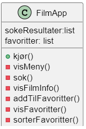
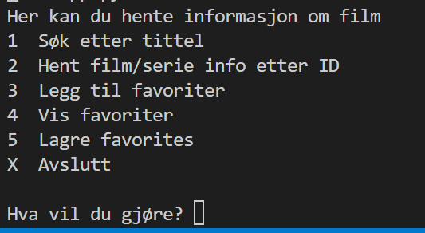

## Enkel terminal app
En terminal applikasjon er en program som kjører i en terminalvindu (fra kommandolinje). 

Brukergrensesnitt er tekstbasert og programet bruker metodene input() og print() for å skrive ut spørsmål til brukeren og samle inn svarene, og vise resultatene på terminal. 

Selv om en terminal applikasjon har en enkel brukergrensesnitt, den fortsatt skal:
- Håndtere feil og gi fornuftige tilbakemeldinger til bruker når feil oppstår.
- Kunne bruke klasser, funksjoner og andre strukturer for å skrive god og gjenbrukbar kode.
- Kunne lese og skrive data fra fil
- Kunne hente data fra en API.


NB! Hvis du er god til å skille brukergrensesnitt fra logikken i applikasjon, vil du kunne gjennbruk kode for å bygge en app med en andre type brukergrensesnitt.

### Film APP

Du skal lage en FilmApp som lar bruker søke film i [OMDb Film API](https://www.omdbapi.com/), hente detaljert informasjon om et bestemt film og legge enkelte filmer til en Favorites-liste.

Applikasjon skal ha en tekstlig bruker interface.

Det første du skal gjøre er å lage en klasse som vil representere appen våres. Klassen er representert med følgende modell:



<div style="background-color:lightblue; border:2px solid black; padding:10px; color:black">
<p>
<h4><b>Oppgave</b></h4>
<p>
<ol>
<li>Opprett en ny folder for prosjektet hvis du ikke har gjort det nå, og åpne det i VSCode. 
<li>Opprett da en ny fil FilmApp.py, der du skrive koden for klassen FilmApp. Du skal lage medlemvariabler, konstruktør og tommer metoder, slik at klassen stemmer med modell over.
<p>
NB! Tomme metoder lager du med python statement `pass. Vi vil fylle innhold i metodene etterhvert. For å lage en tømt metode, uten at det gir kompileringsfeil kan du skriver du: 
<pre><code>
    def Kjør(self):
        pass
</code></pre>
</div> 


Du kan klikke under for å se kode forslag for oppgave over. Du trenger ikke å ha skrevet akkurat slik, men burde ha samme struktur.
<details>
<summary>
  <b>Klikk her for å vise kode forslag</b>
</summary>
<p>
<pre>
    class FilmApp():
        def __init__(self):
            """ konstruktør"""
            self.sokResultater = []
            self.favoritter = []
        #Hovedloop - kjør rog metoder
        def kjør(self):
            pass
        def visMeny(self):
            pass
        def sokFilm(self):
            pass
        def hentFilmInfo(self, film_tittel):
            pass
        def addToFavoritter(self, film):
            pass
        def visFavoriter(self):
            pass
        def sorterFavoritter(self):
            pass  
    <pre>
</details>

#### 1. Hovedloop - metode kjør()

Du skal skrive nå kode for hovedlopp i Appen. Det er en tekstbasert app, som betyr at valgene bruker har for å interargere med appen kommer som tekst på konsolen. Denne Appen kan ha en slik interaksjon:




Vi ønsker at meny skal vises i hele tiden. Koden skal kjører i en evig løkke, som avsluttes når bruker velger valget for "Avslutt". 
I løkken skal skje følgende:

<div style="background-color:lightgreen; border:2px solid black; padding:10px; color:black">
<p>
<h4><b>Algoritme for Kjør() metode:</b></h4>
<p>
<ol>
<li> Vis meny valgene til bruker<br>
<li> Spør bruker om et valg
<li> Sjekk svaret fra bruker og kalle riktig metode koblet til det valget<br>
<li> Sorger for at meny valgene vises på nytt.<br>
</ol>
</div>
.  de gjør som følge:
kjør:

NB! En evig løkke for du med `while True`. For å kunne avbrytte en evig løkke kan du bruke kommandoen `break`

<div style="background-color:lightblue; border:2px solid black; padding:10px; color:black">
<p>
<h4><b>Oppgave</b></h4>
<p>
Gå til din FilmApp klassen og skriv koden under visMeny(self) og kjør(self) metoder, slik beskrevet ovenfør.
<br>


NB! En evig løkke for du med `while True`. For å kunne avbrytte en evig løkke kan du bruke kommandoen `break`


<details>
<summary>
<b>Klikk her for å se kode forslag</b>
</summary>
<pre>
    def kjør(self):
        while True:
            self.visMeny()
            valg = input("Hva vil du gjøre?")
            if valg == '1':
            self.sok()
            elif valg == '2':
                self.hentFilmInfo()
            elif valg == 'X':
                print("Avslutter.")
                break
            else:
                print("Ugyldig valg. Prøv igjen.")
            input("Klikk 'Enter' for å gå til hovedmeny")
    def visMeny(self):
        print("Her kan du hente informasjon om film")
        print("1  Søk etter tittel")
        print("2  Hent film/serie info etter ID")
        print("3  Legg til favoriter")
        print("4  Vis favoriter")
        print("5  Lagre favorites")
        print("X  Avslutt")
        print()  
    <pre>```        
</details>

__Gratulerer! Du har opprettet nå skall til FilmApp. Fortsette å jobbe med Bruk av OMDB API jupyter notebook for å skrive kode for metodene i FilmApp__
