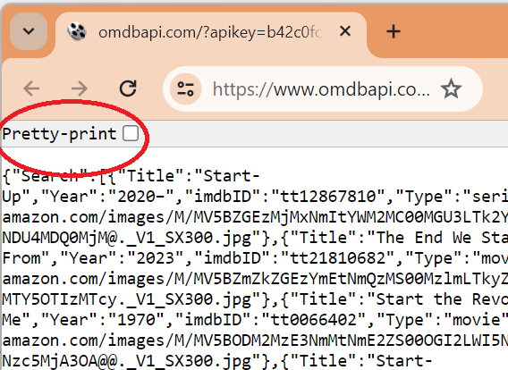

### Enkel bruk av OMDB API

#### __API  - «Application Programming Interface»__
API står for «Application Programming Interface» og er programvare som tillater flere programmer å kommunisere. De aller fleste datatjenester har et API som gjør det mulig å hente ut forskjellige typer data. 
For å bruke et API i Python bruker vi biblioteket «requests». Vi kan da sende en forespørsel (en request) til et API via en URL. Du kan tenke på en URL som navnet på en API-"funksjon"  som tilbys på Internett som du kan kalle på, og som returnerer noe data til deg (ofte i __JSON__ format). En forespørsel til en API via en URL kaller vi en __request__. Vi lærer mer om dette i __IT1__, men har kan du bare tenkte slik. 

En slik URL kan også skrives direkte i en web browser. Du kan prøve dette selv her ved å klikke på denne lenken:  "[Søke på en film som inkludere 'Star'](https://www.omdbapi.com/?apikey=b42c0fc0&s=Start)"

 (__For å se enklere på resultatet Klikk på checkbox "Pretty-print"__ over til venstre eller kopier resultat i [https://jsonlint.com/](https://jsonlint.com/))
 
 


<div style="background-color:lightblue; border:2px solid black; padding:10px; color:black">
<p>
<h4><b>Oppgave</b></h4>
<ol>
<li>Se på URL i web browser  ("https://www.omdbapi.com/?apikey=b42c0fc0&s=Start"), fin teksten 's=Star' og bytt den med 't=Star' 
Ser du forskjell i json som sendes ut?Hva gjør parameter t?
<li>Bytt nå 't=Star' med 'i=tt21810682'. Hva gjør parameter i?
<details>
<summary>
<b>Svar</b>
</summary>
<p>
_?s_ er parameter for å gjøre en søk, mens _?t_ er parameter for å hente info for en bestemt film. Du kan se flere parameter du kan bruke i dokumentasjon til OMDb her:  [OMDb Film API Dokumentasjon](https://www.omdbapi.com/),
</details>
</div>


 Man man kan kalle disse tjenester fra nettsted direkte fra koden. For å bruke et API i Python bruker vi biblioteket `requests` (og `json` hvis det er formatten for data vi får i return)
 
<div style="background-color:lightblue; border:2px solid black; padding:10px; color:black">
<p>
<h4><b>Oppgave</b></h4> 
 1. Legg til koden under til FilmApp.py (eller hva du har kalt filen der du har kode for din Film app). Erstatt API_KEY med nøkkel du fikk.
 </div>


```python
import requests
import json

API_URL = 'https://www.omdbapi.com/'
API_KEY = 'sett din egen api_key her'  

```

<div style="background-color:lightgray; border:2px solid black; padding:10px; color:black">
<b>NB!</b> Hvis du ikke har installert request fra før kan du gjøre dette med 
+ kjøre  <code>pip install requests</code> fra en terminalvindu
<p>
Merk! Hvis du eventuelt vil ha tilgang til API_KEY og API_URL fra forskjellige python filer, kan du flytte disse to linjekoder til en Settings.py fil og inkludere <code>"from Settings import *"</code> i de filene der du vil ha tilgang til konstantene.
</div>

##### Eksempel på kall til OMDb API
OMDb API trenger at du autentiserer deg med en API_KEY. Du må også skrive forskjellige parametrer for å fortelle hvilken funksjon du vil kalle på. 

I Aunivers [Eksempler API-er](https://innhold.aunivers.no/fagpakker/realfag/informasjonsteknologi-1-2/it-2/3-databehandling/eksempel-api-er) så du hvordan man kunne bruke metoden `get()` å hente informasjon fra API-et. Du lærte også at fra `get()` får vi et objekt som inneholder informasjonen vi ønsker å hente. Vi kan også bruke det objektet til å sjekke at forespørselen vår gikk som forventet. Vi får nemlig en statuskode som har verdien 200 hvis alt har gått bra. 

Under finner du en eksempel på hvordan du gjør en søk med kode. 


```python
tittel = "Star Wars: Episode I"           

url = f'http://www.omdbapi.com/?apikey={API_KEY}&s={tittel}' 
response = requests.get(url)

if response.status_code == 200:  
    data = response.json()         # henter svar fra API i json format
    print(json.dumps(data))        
```

#### __FilmApp metoder som bruker OMDb API  - Metode Sok() og HentFilmInfo()__
Neste steg er å begynne å lage innhold på de forskjellige metoder. __Sok()__ søker filmer eller serier basert på tittel via OMDb API og og __HentFilInfo()__ henter informasjon om et bestemt film eller serie basert på id.

__sok()__ er en metode i FilmApp-klassen. Du har opprettet den tidligere som en tomt metode. Denne metode søker etter film  eller series som inneholder en viss tekst i tittel via OMDb API og returnerer en liste med film eller serier som matcher teksten. 

Vi ønsker å laste opp JSON-data som kommer ut av API inn i objektene fra vår modell. For å kunne bruke klassene du lagde, må du importere filen der du skrev koden for klassene inn i FilmApp.py. Dette gjør du med følgende kode:


```python
from Klasser import *
```

Test denne kode ved å kjøre den direkte her, ved å klikke på "Run"-knapp til venstre.
Forstår du koden?


```python
import requests
import json
from Klasser import SokResultat

API_URL = 'https://www.omdbapi.com/'
API_KEY = 'b42c0fc0'   #'sett din egen api_key her'

#Koden for å teste OMDb API

tittel = "Star Wars: Episode II"

url = f"{API_URL}\?apikey={API_KEY}&s={tittel}"
response = requests.get(url)

if response.status_code == 200: 
    data = response.json()

    index = 0
    for filmdata in data["Search"]:
        SokResultat(filmdata)
        print(index, SokResultat(filmdata))
        index += 1
 
```

    0 Title: Star Wars: Episode II - Attack of the Clones, Year:2002, ID:tt0121765, Type:movie
    1 Title: Robot Chicken: Star Wars Episode II, Year:2008, ID:tt1334272, Type:movie
    2 Title: Star Wars: Episode II - Attack of the Clones: Deleted Scenes, Year:2002, ID:tt12247528, Type:movie
    3 Title: Vader Immortal: A Star Wars VR Series - Episode II, Year:2019, ID:tt11323484, Type:game
    4 Title: Star Wars Episode II: Attack of the Clones, Year:2002, ID:tt11543220, Type:game
    5 Title: Star Wars Episode II: The Saga Continues, Year:2000, ID:tt7574890, Type:movie
    6 Title: Star Wars Episode II: Attack of the Clones (2002), Year:2002, ID:tt17977694, Type:movie
    7 Title: Star Wars: Episode II - Attack of the Clones (2002), Year:2002, ID:tt24820830, Type:movie
    


```python
#Merk denn andre måte å fikse url og params. Velg den du forstår best.
tittel = "Star Wars: Episode II"
params = {'apikey': API_KEY, 's': tittel}   #konfigurere parameter til url
response = requests.get(API_URL, params)    #sender request til OMDb

print(response)
```

##### __Metode self.sok()

<div style="background-color:lightblue; border:2px solid black; padding:10px; color:black">
<p>
<h4><b>Oppgave</b></h4> 
 Bruk koden som har blitt presentert som inspirasjon og skriv koden for den tomme <b>sok()-metodet</b>  du skrev tidligere i <b>FilmApp-klassen</b>. 
<p>
<div style="background-color:lightgreen; border:2px solid black; padding:10px; color:black">
<p>
Algorite for Metode Sok():
<ol>
    <li> Be bruker om tittle-ord  (tips input)
    <li> Lag URL med parameters og send _request_ to OMDB API  (tips: samme som i eksempel kode)
    <li> Hvis man får en korrekt <i>response</i> :  
    <ul>
    <li> Hent json data fra response
    <li> Gå gjennom alle elementer i "Search"-listen og lag en SokResultat-objekt per treff
    <li> Lagre sisteSokResultat i en i FilmApp-en ( tips: bruk en meldemvariabel)
    <li> Vise listen  (tips: lag en metode som skriver ut listen)
    </ul>
    <li> Hvis man ikke får en korrekt _response_ fra webAPI:
    <ul><li> Skriv ut en passende beskjed.
</ol>
</div>
</div>

<div>
<details>
<summary>
<b> Forslag til kode</b>
</summary>
      # Metoder knytte til meny valgene
<p>
<pre>
    def sok(self):    
    # send request til API
    tittel = input("Skriv inn tittelen eller deler av tittel: ")
    params = {'apikey': API_KEY, 's': tittel}   #konfigurere parameter til url
    response = requests.get(API_URL, params)    #sender request til OMDb nettsted
    #
    # hente json-data
    if response.status_code == 200:   
        data =  response.json()        # henter data fra API i json format
    else:                              # Noe gikk galt ved API request
        print('Feil ved henting av informasjon fra OMDb.')
    #
    if data["Response"] == "False":   # sjekker om OMDb API tjeneste kall gikk bra.
            print(data["Error"])      #skriv ut error fra OMDb
    #
    # Lagre liste med SokResultat fra siste søk resultat i appen 
    sisteSok = []
    filmListe = data["Search"]
    for filmdata in filmListe:
            sisteSok.append(SokResultat(filmdata))
    self.sistSokResultat = sisteSok
    #    
    # Skrive ut resultat liste på konsoll
    for index, film in enumerate(self.sistSokResultat):
        print(index, film)
    </pre>
</details>
</div>

##### __Metode self.hentFilmData()

<div style="background-color:lightblue; border:2px solid black; padding:10px; color:black">
<h4><b>Oppgave<b></h4> 
Bruk koden over som inspirasjon og Skriv koden for den tomme <b>hentFilmInfo()-metodet</b> du skrev tidligere i <b>FilmApp-klassen</b>. 
<p>
<div style="background-color:lightgreen; border:2px solid black; padding:10px; color:black">
Algoritme for Metode HentFilmInfo():
<ol>
    <li> Be bruker om id til filmen hen ønsker info om (tips input)
    <li> Lag URL med parameters og send _request_ to OMDB API  (tips: samme som i eksempel kode men med i='imdbID som parameter)
    <li> Hvis man får en korrekt _response_ :  
    <ul>
    <li> Hent json data fra response
    <li> Sjekk type i response: 'movie' eller 'serie' og opprette riktig type objekt
    <li> Vise info for media type
    </ul>
    <li> Hvis man ikke får en korrekt _response_ fra webAPI:
    <ul><li> Skriv ut en passende beskjed.
</ol>
</div>
</div>

<details>
<summary>
<b> Forslag til kode</b>
</summary>
<pre>
    # Metoder knytte til meny valgene
    def hentFilmInfo():
        # send request til API
        id = input("Skriv inn tittelen eller deler av id: ")
        params = {'apikey': API_KEY, 'i': id}   #konfigurere parameter til url
        response = requests.get(API_URL, params)    #sender request til OMDb nettsted
</pre>
<pre><code>
        # hente json-data
        if response.status_code == 200:   
            data =  response.json()        # henter data fra API i json format
        else:                              # Noe gikk galt ved API request
            print('Feil ved henting av informasjon fra OMDb.')
 </code></pre>
 <pre>   
        if data["Response"] == "False":   # sjekker om OMDb API tjeneste kall gikk bra.
                print(data["Error"])      #skriv ut error fra 
                return
  </pre>
  <pre>      
        # Sjekk type og skrive ut
        if data.get("Type") == 'movie':
            print(Film(data).visInfo())
        elif data.get("Type") == 'series':
             print(Serie(data).visInfo())
    </pre>
</details>
